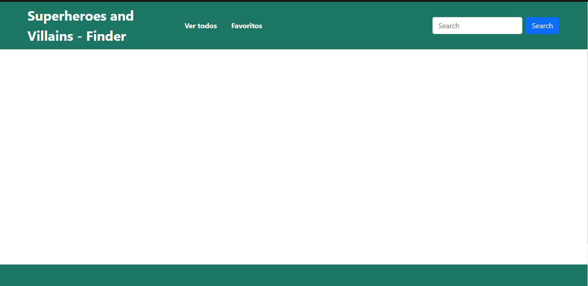
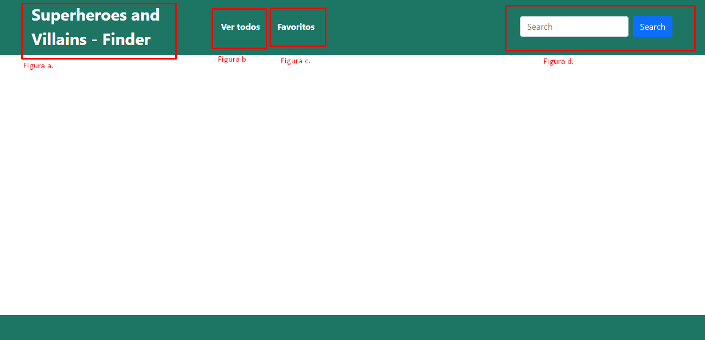
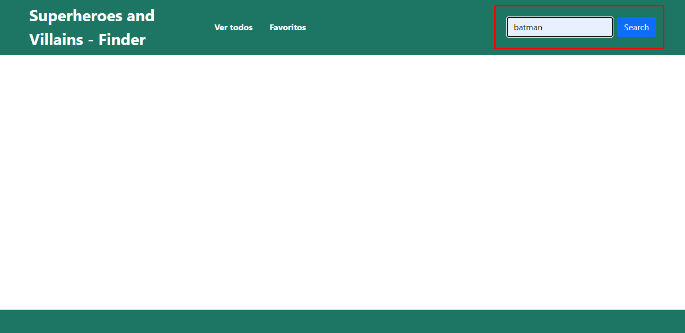
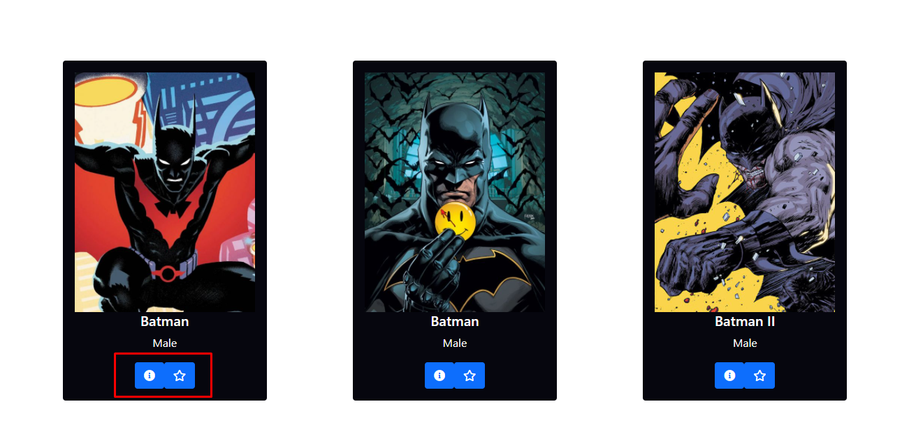
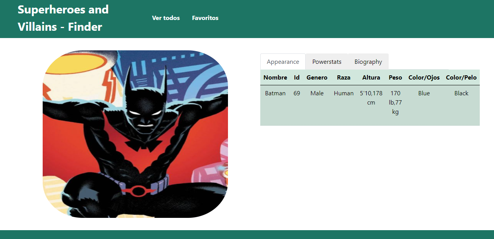
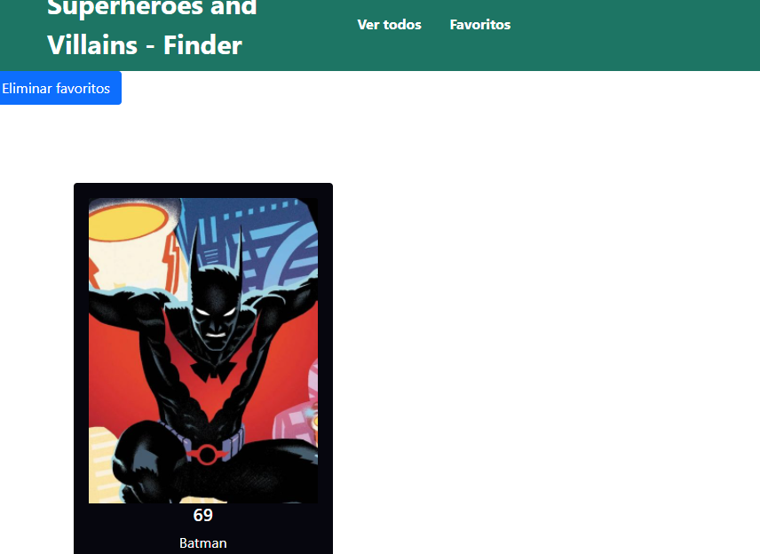

# SuperHero API: ¿Que es SuperHero API? 🦸

La API de superhéroes es una fuente de datos cuantificada y accesible mediante programación de todos los superhéroes del universo del cómic. Hemos tomado todas las cosas y las hemos reunido en una forma que es más fácil de consumir con software. Luego creamos una API para que puedas consumirla sin problemas.
Mas información: https://superheroapi.com/index.html

Proyecto en linea temporalmente: https://superheroapicla.herokuapp.com

# Instalación: Descargar repositorio 🔧

1. En GitHub, visita la página principal del repositorio.
2. Dar click en boton Code (color verde).
3. Presionar la opciones "Download ZIP. Automáticamente el proyecto se comenzará a descargar.


4. Situarse en la ubicación de donde se descargo el proyecto.
5. Descomprimir el proyecto.

Nota: Es importante tener instalado [WinRAR](https://www.winrar.es/descargas)

# Instalación: Dependencias 🔧

1. Ubicarse en la ruta ...\CLA-master\Hero del proyecto.


2. Borrar la ruta, escribir "cmd" y presionar Enter. Automáticamente se abrirá cmd.exe
3. Escribir el siguiente comando en cmd.exe

```bash
npm install
```


4. Escribir el siguiente comando en cmd.exe
```bash
npm start
```
5. Ir a su navegador de preferencia y en la ruta, escribir:

http://localhost:3000

6. Si todo salió exitoso, se mostrará la pagina principal.


Nota: Es importante tener instalado [Node.js](https://nodejs.org/es/)

# Ejecutando las pruebas ⚙️

1. Página principal. URL: http://localhost:3000



2.  Pagina principal. URL: http://localhost:3000



Figura a: Redirecciona a [pagina principal](http://localhost:3000)
Figura b: 
Figura c: Para ver los heroes favoritos. Redirecciona a [favoritos](http://localhost:3000/allFav)
Figura d: Campo para escribir el nombre de heros y boton para realizar la busqueda.

3. Buscar heroe por su nombre. Al dar click realizara la busqueda



4. Resultado de busqueda de heroe. Cada tarjeta posee dos botones: 1. Informacion del heroe. 2. Agregar heroe a favoritos.



5.  Al dar click en boton informacion del heroe mostrara la siguiente informacion. Separado por bloques: Apparence, powerstats, biography



6.  Al dar click en boton favoritos lo agregara a una lista de favoritos



# Autores ✒️
Diseñado por [Roberto Hernandez](https://www.linkedin.com/in/roberto-hernandez-623a23189/)

# Construido con 🛠️
1. [Node.js](https://nodejs.org/es/about/)
2. [Express.js](https://expressjs.com/es/)
3. [Javascript](https://developer.mozilla.org/es/docs/Web/JavaScript)
4. [jQuery](https://jquery.com)
5. [Html](https://www.w3schools.com/html/)
6. [CSS3](https://www.w3schools.com/css/)

### Terceros
1. [FontAwesome](https://fontawesome.com)
2. [Bootstrap](https://getbootstrap.com)
3. [Visual Studio Code](https://code.visualstudio.com)
