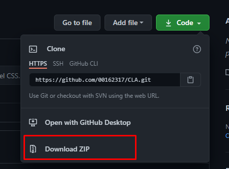
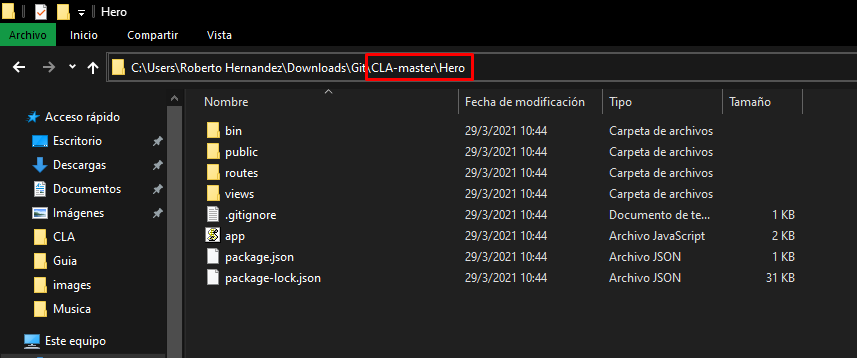
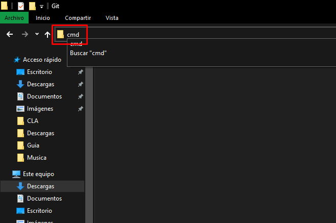

# SuperHero API: ¿Que es SuperHero API? 🦸

La API de superhéroes es una fuente de datos cuantificada y accesible mediante programación de todos los superhéroes del universo del cómic. Hemos tomado todas las cosas y las hemos reunido en una forma que es más fácil de consumir con software. Luego creamos una API para que puedas consumirla sin problemas.
Mas informacion: https://superheroapi.com/index.html


# Instalación: Descargar repositorio 🔧

1. En GitHub, visita la página principal del repositorio.
2. Dar click en boton Code (color verde).
3. Presionar la opciones "Download ZIP. Automaticamente el proyecto se comenzara a descargar.



4. Ubicar la ubicacion de donde se descargo el proyecto.
5. Descomprimir el proyecto.

Nota: Es importante tener instalado [WinRAR](https://www.winrar.es/descargas)

# Instalación: Dependencias 🔧

1. Ubicarse en la ruta ...\CLA-master\Hero del proyecto.



2. Borrar la ruta, escribir "cmd" y presionar Enter
3. Escribir el siguiente comando en cmd.exe

```bash
npm install
```



4. Escribir el siguiente comando en cmd.exe
```bash
npm start
```
5. Ir a un navegador de preferencia y en la ruta, escribir:

http://localhost:3000

6. Si todo salio exitoso, se mostrara la pagina principal.


Nota: Es importante tener instalado [Node.js](https://nodejs.org/es/)

# Ejecutando las pruebas ⚙️

# Autores ✒️
Diseñado por Roberto Hernandez

# Construido con 🛠️
1. [Node.js](https://nodejs.org/es/about/)
2. [Express.js](https://expressjs.com/es/)
3. [Javascript](https://developer.mozilla.org/es/docs/Web/JavaScript)
4. [Html](https://www.w3schools.com/html/)
5. [CSS3](https://www.w3schools.com/css/)

### Terceros
1. [FontAwesome](https://fontawesome.com)
2. [Bootstrap](https://getbootstrap.com)
3. [Visual Studio Code](https://code.visualstudio.com)
